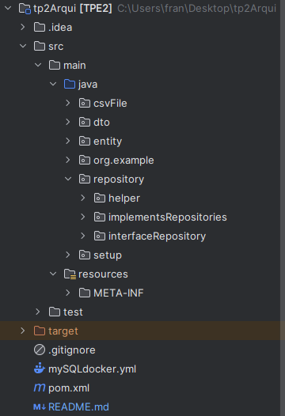

# ArquitecturaWebTudaiG25TP2ArquitecturaWebTudaiG25TP2

Este proyecto es una aplicación basada en Java que utiliza JPA con Hibernate para la gestión de estudiantes y carreras en una base de datos. Implementa el patrón Repository junto con Factory para gestionar las entidades y las consultas, y se conecta a la base de datos a través de un archivo persistence.xml.

## Estructura del Proyecto

### Diagrama Entidad-Relacion


### Archivo raiz


### Patrón Repository y Factory

Se utiliza el patrón Repository para encapsular las consultas y las operaciones CRUD sobre las entidades.
Cada entidad se corresponde con una implementación de repositorio concreta. Para la creación y gestión de estos repositorios, utilizamos un Repository Factory, el cual se encarga de instanciar los repositorios correspondientes según la entidad solicitada.
Para esta aplicación, al utilizar JPA, estas entidades extienden de **JPARepository** donde  según la necesidad de implementar consultas personalizadas segun la entidad estas agregan o modifican los metodos heredados.

Esto nos permite:

Desacoplar la lógica de acceso a datos de la lógica de negocio.
Mantener una estructura de código modular y fácil de mantener.
Facilitar la reutilización de consultas y operaciones comunes sobre las entidades.

### Uso de JPA con Hibernate
Se utiliza JPA (Java Persistence API) junto con Hibernate como proveedor de persistencia. Esto permite gestionar la base de datos a través de anotaciones en las entidades, eliminando la necesidad de escribir SQL manualmente para operaciones comunes.

Las entidades se modelan como clases Java, con las anotaciones de JPA para definir la relación entre las clases y las tablas de la base de datos.
En las entidades se encuentran implementadas named queries, lo que permite definir las consultas JPQL de manera declarativa y reutilizable.
Ejemplo de una entidad:

```java

@Entity
@NamedQuery(name= City.BUSCAR_TODAS, query=" SELECT c FROM  City c")
public class City {

    public static final String BUSCAR_TODAS = "City.BUSCAR_TODAS";

    @Id
    private int idCity;

    @Column
    private String name;

    public City() {
    }

    public City(int idCity, String name) {
        this.idCity=idCity;
        this.name = name;
    }
```

### EntityManager y HelperEntity
Todas las consultas y operaciones sobre la base de datos se realizan a través del EntityManager.
Para centralizar la creación y gestión de EntityManager, se utiliza una clase auxiliar llamada EntityManagerHelper.

**La clase EntityManagerHelper:**

Proporciona un punto central para obtener instancias de EntityManager en cualquier parte del proyecto.
Facilita el manejo de transacciones y la apertura/cierre de conexiones a la base de datos.
Ejemplo de su uso:

```java
    @Override
    public void persist(Entity entity) {
        //solicitud de entity manager(instancia)
        em=EntityManagerHelper.getEntityManager();
        try{
            em.getTransaction().begin();
            em.persist(entity);
            em.getTransaction().commit();
        }catch (Exception e) {
            throw new RuntimeException("Error al insertar"+entity.toString()+e);
        }finally {
            em.close();
        }
    }
```
## Consultas en los Repositorios
En cada implementación de los repositorios, se realizan las consultas a través de JPQL utilizando el EntityManager. Estas consultas permiten operaciones complejas como búsquedas con filtros, agrupamientos y ordenamientos. Las consultas también devuelven **DTOs** (Data Transfer Objects) cuando es necesario exponer datos combinados de múltiples entidades.

Ejemplo de consulta:

```java
public StudentDTO studentByRecord(int idLibreta){
        EntityManager em = EntityManagerHelper.getEntityManager();
        Student result = null;
        try {
            result = (Student) em.createNamedQuery(Student.BUSCAR_POR_LIBRETA)
                                         .setParameter("libreta", idLibreta).getSingleResult();
        } catch (NoResultException e){
            System.out.println("No existe la libreta ingresada");
            return null;
        } finally{
            em.close();
        }
        return new StudentDTO(result.getDni(),result.getIdLibreta(),result.getName(),
                              result.getLastName(),result.getGender(),result.getCity().getName(),result.getYears());
    }
```

## Persistencia con persistence.xml
   Al ser una aplicación que utiliza JPA, la configuración de la conexión a la base de datos se gestiona a través del archivo **persistence.xml**. Este archivo se encuentra en la **carpeta resourses/META-INF** y contiene la configuración de la unidad de persistencia, especificando el proveedor de persistencia (Hibernate), las credenciales de acceso a la base de datos y otras propiedades necesarias para la conexión.

```xml
<persistence xmlns="http://xmlns.jcp.org/xml/ns/persistence"
             xmlns:xsi="http://www.w3.org/2001/XMLSchema-instance"
             xsi:schemaLocation="http://xmlns.jcp.org/xml/ns/persistence
             http://xmlns.jcp.org/xml/ns/persistence/persistence_2_1.xsd"
             version="2.1">
    <persistence-unit name="my_persistence_unit">
        <provider>org.hibernate.jpa.HibernatePersistenceProvider</provider>

        <class>entity.Career</class>
        <class>entity.City</class>
        <class>entity.Courses</class>
        <class>entity.Student</class>

        <properties>
            <property name="javax.persistence.jdbc.driver" value="com.mysql.cj.jdbc.Driver" />
            <property name="javax.persistence.jdbc.url" value="jdbc:mysql://localhost:3306/Integrador2?createDatabaseIfNotExist=true" />
            <property name="javax.persistence.jdbc.user" value="user" />
            <property name="javax.persistence.jdbc.password" value="password" />

            <!-- Hibernate: Maneja la creación de las tablas -->
            <property name="hibernate.hbm2ddl.auto" value="update"/>
            <property name="hibernate.dialect" value="org.hibernate.dialect.MySQL8Dialect"/>
        </properties>
    </persistence-unit>
</persistence>
```


## Docker para la Base de Datos 
Se utiliza un contenedor Docker para levantar la base de datos MySQL. El archivo docker-compose.yml define la configuración de la imagen de MySQL, con las credenciales y el puerto necesarios para la conexión desde la aplicación Java.

        MYSQL_ROOT_PASSWORD: rootpassword
        MYSQL_DATABASE: Integrador2
        MYSQL_USER: user
        MYSQL_PASSWORD: password
        ports:
        - "3306:3306"


## Uso de DTOs (Data Transfer Objects)
   Para evitar exponer directamente las entidades en las respuestas de las consultas, se utilizan DTOs. Estos objetos sirven como una capa intermedia para transferir los datos necesarios entre la capa de persistencia y la capa de presentación. Los DTOs se utilizan especialmente cuando la consulta combina datos de múltiples entidades o cuando solo se requiere un subconjunto de los atributos de una entidad.


# Instalación y Configuración


#### Configurar la base de datos:
Levantar la base de datos con Docker utilizando el archivo docker-compose.yml:

        docker-compose up -d

El esquema utilizado necesita de la configuración de nombre, usuario y contraseña:

        MYSQL_ROOT_PASSWORD: rootpassword
        MYSQL_DATABASE: Integrador2
        MYSQL_USER: user
        MYSQL_PASSWORD: password
        ports:- "3306:3306"

#### Configurar la aplicación:
Asegurarse de que el archivo persistence.xml tenga las credenciales correctas para conectarse a la base de datos MySQL levantada en Docker.

#### Ejecutar la aplicación:
La aplicación se ejecuta desde la clase **App** se ubica en la ruta:
        
    src/main/java/org/example/App.java

# Funcionamiento de la aplicación
  Una vez ejecutada la aplicación, esta se encarga de leer varios archivos CSV ubicados en la carpeta csvFiles.

  Estos datos son ingresados en la base de datos, por medio de los metodos que los repositorios de cada entidad proveen, luego de haber sido inicializados.

  Una vez existente persistidos los datos, se procede a mostrar por consola el resultado de las consultas ejecutadas segun ciertos criterios:

    a) dar de alta un estudiante
    b) matricular un estudiante en una carrera
    c) recuperar todos los estudiantes, y especificar algún criterio de ordenamiento simple.
    d) recuperar un estudiante, en base a su número de libreta universitaria.
    e) recuperar todos los estudiantes, en base a su género.
    f) recuperar las carreras con estudiantes inscriptos, y ordenar por cantidad de inscriptos.
    g) recuperar los estudiantes de una determinada carrera, filtrado por ciudad de residencia.
    
    3)Generar un reporte de las carreras, que para cada carrera incluya información de los
    inscriptos y egresados por año. Se deben ordenar las carreras alfabéticamente, y presentar
    los años de manera cronológica. 


